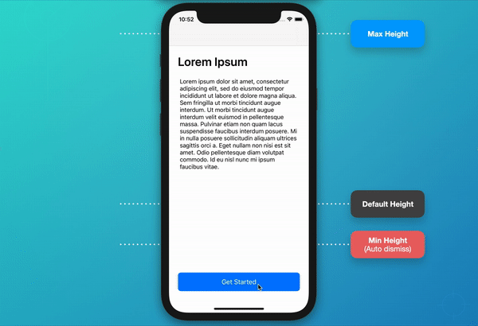
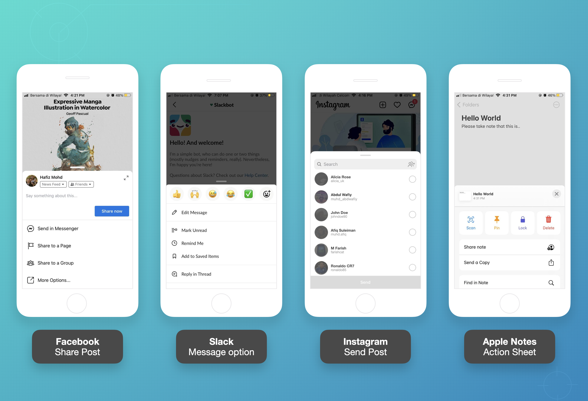

## Description
iOS simple project to create half-screen modal view controller with pan / draggable (expand and dismiss animation)

Visit my [article](https://betterprogramming.pub/how-to-present-a-bottom-sheet-view-controller-in-ios-a5a3e2047af9) on medium.com for detail explanation. Thanks for your claps and share!

### Specification

- Xcode 12+
- Swift 5

### UI Inspiration

### License
Licensed under the [MIT license](http://opensource.org/licenses/MIT)
